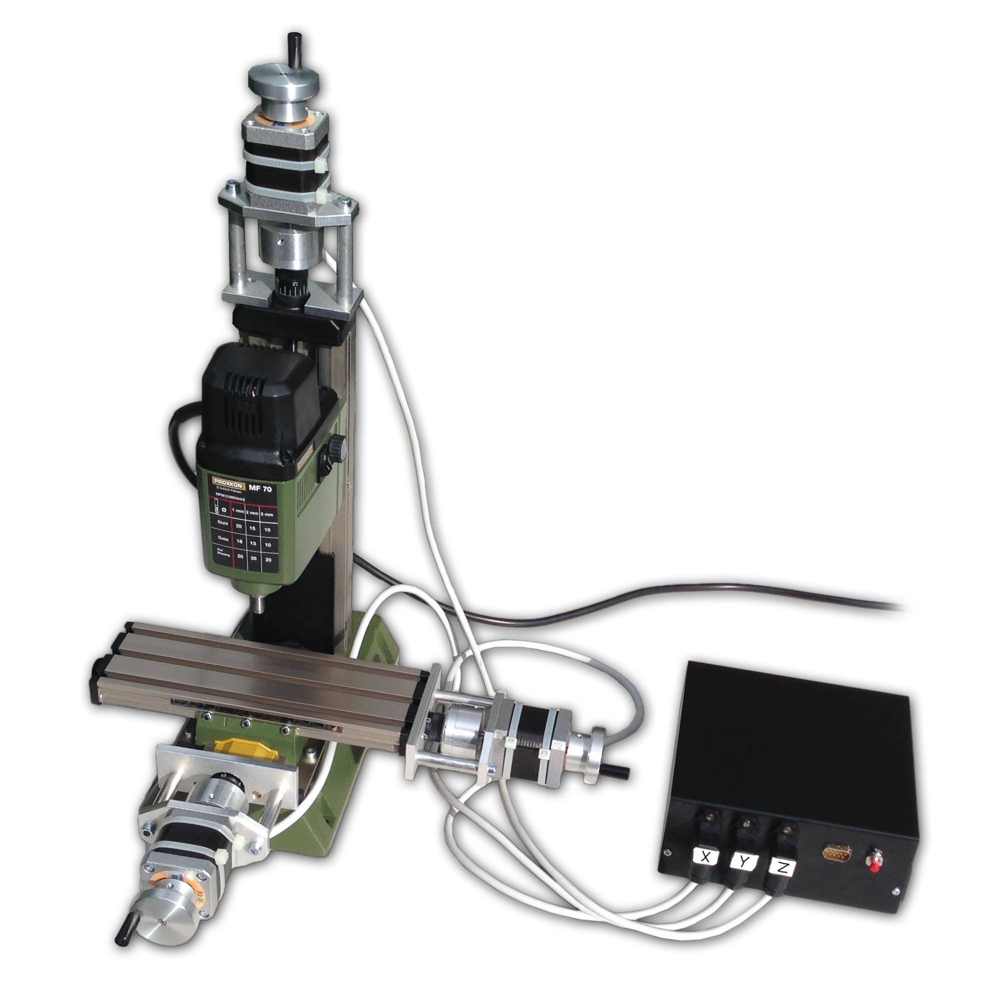

# PrismCNC
Free 3 axis CNC project

Software:
The backend is written in C++11 and runs on the pcDuino-V3-nano.
The frontend CLI is written in JavaScript and
a supporting [Blender](https://www.blender.org) plugin in Python.

Example hardware implementation:

Euro    | Dollar  | Name and Link
------- | ------- | -------------------
255.00€ | $285.43 | [Miller](http://www.sorotec.de/shop/Proxxon/Proxxon-Micromot/MICRO-miller-MF-70.html)
135.00€ | $151.11 | [CNC-Kit Proxxon MF 70](http://www.ebay.com/itm/221921493227)
49.99€  | $55.96  | [Mainboard](http://www.conrad.de/ce/de/product/1274214/pcDuino-V3-nano-Einplatinencomputer-Linux-Ubuntu-Version-1204-Arduino-I-D-E)
38.12€  | $42.66  | [Motor Drivers](http://www.ebay.com/itm/310732396961)
23.05€  | $25.80  | [Power Supply](http://www.reichelt.de/Schaltnetzteile-Case-geschlossen/SNT-RD-65A/3/index.html?&ACTION=3&LA=2&ARTICLE=137100&GROUPID=4959&artnr=SNT+RD+65A)
17.40€  | $19.48  | [Casing](http://www.reichelt.de/Teko-Alu-Gehaeuse/TEKO-383/3/index.html?&ACTION=3&LA=2&ARTICLE=21196&GROUPID=5201&artnr=TEKO+383)
7.05€   | $7.90   | [Connectors](http://www.reichelt.de/G-Serie/G4-W1F/3/index.html?&ACTION=3&LA=2&ARTICLE=52077&GROUPID=3263&artnr=G4+W1F)
5.10€   | $5.71   | [Connectors](http://www.reichelt.de/G-Serie/G4-A5M/3/index.html?&ACTION=3&LA=2&ARTICLE=52079&GROUPID=3263&artnr=G4+A5M)
6.75€   | $7.56   | [Connectors](http://www.reichelt.de/Kaltgeraeteeinbaustecker/KM-01-1105/3/index.html?&ACTION=3&LA=2&ARTICLE=44537&GROUPID=5204&artnr=KM+01.1105)
1.25€   | $1.40   | [Fuse](http://www.reichelt.de/Kaltgeraeteeinbaustecker/KM-01SH-1/3/index.html?&ACTION=3&LA=2&ARTICLE=58884&GROUPID=5204&artnr=KM+01SH-1)
0.77€   | $0.87   | [Fuse](http://www.reichelt.de/5x20mm-Feinsicherungen/FLINK-4-0A/3/index.html?&ACTION=3&LA=2&ARTICLE=7837&GROUPID=3301&artnr=FLINK+4%2C0A)
2.20€   | $2.47   | [Screws](http://www.reichelt.de/Flach-Senkkopf-Schlitz-DIN963-/SSK-M2X10-200/3/index.html?&ACTION=3&LA=2&ARTICLE=65728&GROUPID=2754&artnr=SSK+M2X10-200)
3.10€   | $3.47   | [Screws](http://www.reichelt.de/Flach-Senkkopf-Schlitz-DIN963-/SSK-M4X20-200/3/index.html?&ACTION=3&LA=2&ARTICLE=65741&GROUPID=2754&artnr=SSK+M4X20-200)
1.15€   | $1.29   | [Screws](http://www.reichelt.de/6-kant-Muttern/SK-M4/3/index.html?&ACTION=3&LA=2&ARTICLE=18084&GROUPID=2761&artnr=SK+M4)
0.81€   | $0.91   | [Button](http://www.reichelt.de/Drucktaster-Druckschalter/S-1323-RT/3/index.html?&ACTION=3&LA=2&ARTICLE=15414&GROUPID=3277&artnr=S+1323+RT)
2.95€   | $3.31   | [Shrink Tubing](http://www.pollin.de/shop/dt/NDI3OTkxOTk-/Bauelemente_Bauteile/Sortimente/Sonstiges/Schrumpfschlauch_Sortiment_schwarz.html)
0.50€   | $0.56   | [Pins](http://www.pollin.de/shop/dt/NzIzOTU1OTk-/Bauelemente_Bauteile/Mechanische_Bauelemente/Steckverbinder_Klemmen/Stiftleiste.html)
2.95€   | $3.30   | [Wires](http://www.pollin.de/shop/dt/Njk5OTkxOTk-/Haustechnik/Kabel_Draehte_Litzen/Litzen/Litzen_Sortiment_0_14_mm_5x_5_m.html)
1.80€   | $2.02   | [Wires](http://www.pollin.de/shop/dt/MzI1ODQ1OTk-/Bauelemente_Bauteile/Mechanische_Bauelemente/Steckverbinder_Klemmen/Buchsenleiste_Serie_PS.html)
0.90€   | $1.01   | [Wires](http://www.pollin.de/shop/dt/ODI1ODQ1OTk-/Bauelemente_Bauteile/Mechanische_Bauelemente/Steckverbinder_Klemmen/Buchsenleiste_Serie_PS.html)
0.78€   | $0.88   | [Connectors](http://www.pollin.de/shop/dt/MzQxOTQ1OTk-/Bauelemente_Bauteile/Mechanische_Bauelemente/Steckverbinder_Klemmen/Leiterplatten_Anschlussklemme_XY301V.html)
4.08€   | $4.57   | [Connectors](http://www.pollin.de/shop/dt/NTIzODQ1OTk-/Bauelemente_Bauteile/Mechanische_Bauelemente/Steckverbinder_Klemmen/Anschlussklemme_PTR_AKZ950_2_polig_gruen.html)
1.56€   | $1.75   | [Connectors](http://www.pollin.de/shop/dt/MDIzODQ1OTk-/Bauelemente_Bauteile/Mechanische_Bauelemente/Steckverbinder_Klemmen/Stiftleiste_PTR_STLZ950_2_polig_90_gruen.html)
562.26€ | $629.35 | Sum

Delivery costs not included
last checked 2015/10/01
